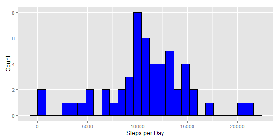
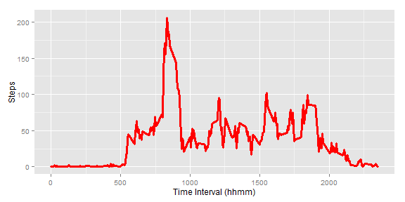
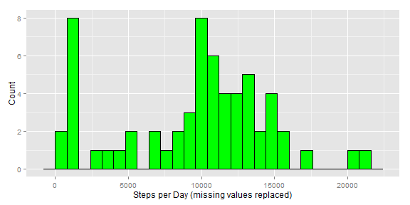
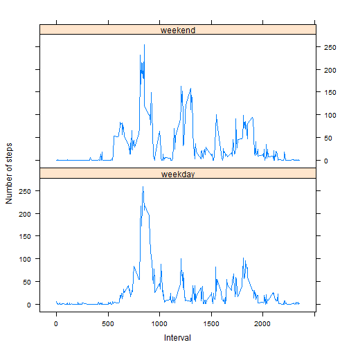

Reproducible Research Assignment 1
==================================

#### Load the dataset to prepare for analysis. (Give working dataset a different name than original dataset.)

```r
rawdata = read.csv("activity.csv", header=T, stringsAsFactors=F)
data=rawdata
```


#### What is mean total number of steps taken per day?
1. Make a histogram of the total number of steps taken each day.
For this part of the assignment, you can ignore the missing values in the dataset.

```r
## Sum the steps taken per day and rename the variables columns
histdata = with(data, aggregate(steps, by = list(date), sum))
names(histdata) = c("Date", "Steps")
## Look at the first few rows of data
head(histdata)
```

```
##         Date Steps
## 1  10/1/2012    NA
## 2 10/10/2012  9900
## 3 10/11/2012 10304
## 4 10/12/2012 17382
## 5 10/13/2012 12426
## 6 10/14/2012 15098
```


```r
## Use ggplot to build and format the histogram
library(ggplot2)
histgraph = ggplot(histdata, aes(x = Steps)) + 
      geom_histogram(binwidth = 800, color="black", fill="blue") + 
      labs(x = "Steps per Day", y = "Count")
histgraph
```

 


2. Calculate and report the mean and median total number of steps taken per day.

```r
meansteps = mean(histdata$Steps, na.rm = T)
mediansteps = median(histdata$Steps, na.rm = T)
meansteps
```

```
## [1] 10766
```

```r
mediansteps
```

```
## [1] 10765
```


#### What is the average daily activity pattern?
1. Make a time series plot (i.e. type = "l") of the 5-minute interval (x-axis) and the average number of steps taken, averaged across all days (y-axis).

```r
## Sum the avg steps taken and rename the variables columns
tseriesdata = with(data, aggregate(steps, by = list(interval), mean, 
                                            na.rm = T))

names(tseriesdata) = c("Interval", "MeanSteps")
## Look at the first few rows of data
head(tseriesdata)
```

```
##   Interval MeanSteps
## 1        0   1.71698
## 2        5   0.33962
## 3       10   0.13208
## 4       15   0.15094
## 5       20   0.07547
## 6       25   2.09434
```


```r
## Use ggplot to build and format the line graph
tseriesgraph = ggplot(tseriesdata, aes(x = Interval, y = MeanSteps)) + 
      geom_line(color = "red", size = 1.25) +  
      labs(x = "Time Interval (hhmm)", y = "Steps")
tseriesgraph
```

 


2. Which 5-minute interval, on average across all the days in the dataset, contains the maximum number of steps?

```r
maxsteps = tseriesdata$Interval[which.max(tseriesdata$MeanSteps)]
maxsteps
```

```
## [1] 835
```


####Imputing missing values
1. Calculate and report the total number of missing values in the dataset (i.e. the total number of rows with NAs).

```r
sumNA = sum(is.na(data$steps))
sumNA
```

```
## [1] 2304
```


2. Devise a strategy for filling in all of the missing values in the dataset. The strategy does not need to be sophisticated. For example, you could use the mean/median for that day, or the mean for that 5-minute interval, etc.

3. Create a new dataset that is equal to the original dataset but with the missing data filled in.

```r
## Create another copy of the data to use for replacing NAs
fulldata = data
completedata = with(fulldata, aggregate(steps, by = list(interval), median, 
                                            na.rm = T))
## Rename the variables columns
names(completedata) = c("interval", "steps")
## Look at the first few rows of data
head(completedata)
```

```
##   interval steps
## 1        0     0
## 2        5     0
## 3       10     0
## 4       15     0
## 5       20     0
## 6       25     0
```

```r
for (i in 1:nrow(fulldata)) {
      if (is.na(fulldata$steps[i]) == T) {
            fulldata$steps[i] = completedata$steps[data$interval[i] == 
                                                           completedata$interval]
      } else {          
      }
}
## If NAs were replaced, sum should now be zero
sum(is.na(fulldata$steps))
```

```
## [1] 0
```


4. Make a histogram of the total number of steps taken each day and Calculate and report the mean and median total number of steps taken per day. Do these values differ from the estimates from the first part of the assignment? What is the impact of imputing missing data on the estimates of the total daily number of steps?

```r
## Sum the steps in each day and rename variables columns
histcompdata = with(fulldata, aggregate(steps, by = list(date), sum))
names(histcompdata) = c("Date", "Steps")

## Use ggplot to build and format the histogram
library(ggplot2)
histcomplete = ggplot(histcompdata, aes(x = Steps)) + 
      geom_histogram(binwidth = 800, color="black", fill="green")+ 
      labs(x = "Steps per Day (missing values replaced)", y = "Count")
histcomplete
```

 


```r
## Recalculate mean
meancompsteps = mean(histcompdata$Steps, na.rm=T)
meancompsteps
```

```
## [1] 9504
```

```r
## Compare to original mean value
meansteps
```

```
## [1] 10766
```

```r
## Recalculate median
mediancompsteps = median(histcompdata$Steps, na.rm=T)
mediancompsteps
```

```
## [1] 10395
```

```r
## Compare to original median value
mediansteps
```

```
## [1] 10765
```

```r
## Replacing missing values obviously makes a substantial difference!
```


#### Are there differences in activity patterns between weekdays and weekends?
For this part the weekdays() function may be of some help here. Use the dataset with the filled-in missing values for this part.

1. Create a new factor variable in the dataset with two levels - "weekday" and "weekend" indicating whether a given date is a weekday or weekend day.

```r
fulldata$date = as.Date(fulldata$date)
dateweekdays = weekdays(fulldata$date)
dateweekend =  dateweekdays == "Sunday" | dateweekdays == "Saturday"
fulldata$day = factor(as.integer(dateweekend),
                            levels=c(0, 1),
                            labels=c("weekday", "weekend"))
## Look at the first few rows of data with added variable
head(fulldata)
```

```
##   steps       date interval     day
## 1     0 0010-01-20        0 weekday
## 2     0 0010-01-20        5 weekday
## 3     0 0010-01-20       10 weekday
## 4     0 0010-01-20       15 weekday
## 5     0 0010-01-20       20 weekday
## 6     0 0010-01-20       25 weekday
```


2. Make a panel plot containing a time series plot (i.e. type = "l") of the 5-minute interval (x-axis) and the average number of steps taken, averaged across all weekday days or weekend days (y-axis).

```r
## Use lattice plot to build and format the graph
library('lattice')
weekdata = aggregate(steps ~ interval + day, FUN="mean", data = fulldata)
xyplot(steps ~ interval | day, data = weekdata,
         xlab = 'Interval', ylab = 'Number of steps',
         type = 'l', layout=c(1, 2))
```

 
